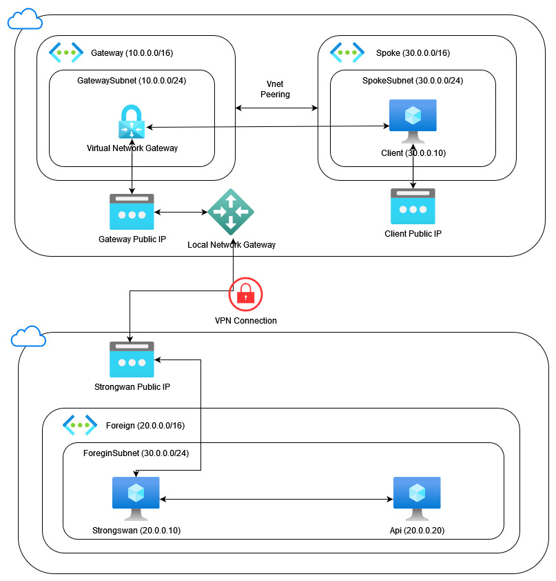
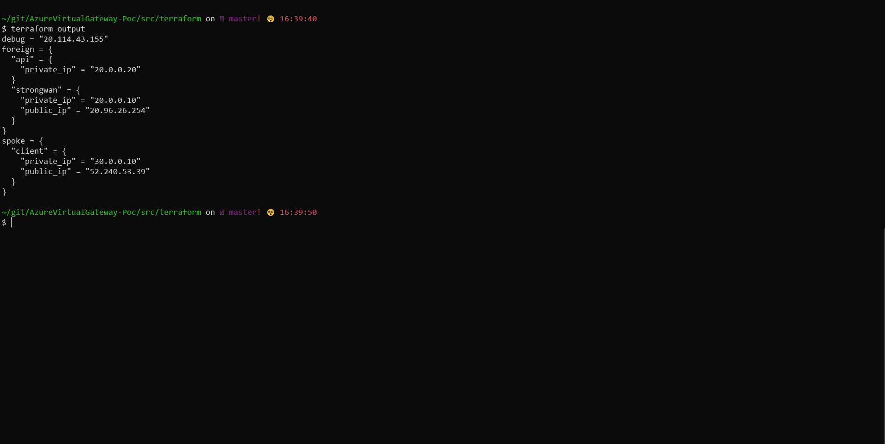

# Azure Network Gateway with Hub-Spoke Network Topology

This project intends to setup a vpn tunnel using the Azure Network Gateway resource, and allow all virtual networks (vnets) peered to use the vpn tunnel. In order to archive this, a network topology called `Hub-Spoke` was utilized.



## Setup
---

- [Create an Azure Account](https://azure.microsoft.com/en-us/free/)
- [Install TF_ENV](https://github.com/tfutils/tfenv)

## Usage
---

This environment is totally build using [Terraform](https://www.terraform.io/)

```bash
cd src/terraform
tfenv install
tfenv use
terraform init
terraform apply
```

## Results
---

